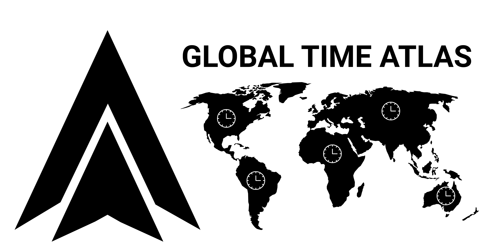

<p align="center">
  
</p>

# Global Time Atlas

<p align="center">
  <a href="https://gtasolution.rexiumtech.com">Global Time Atlas</a>
</p>

<p align="center">
  <a href="https://github.com/Rexiumtech/global-time-atlas#quick-start"></a>
  <a href="https://gtasolution.rexiumtech.com"></a>
  <a href="LICENSE"></a>
  <a href="mailto:info@rexiumtech.com"></a>
  <a href="https://rexiumtech.com"></a>
</p>

A bilingual (English / Spanish), daylight-saving-aware timezone converter. Enter a date and time, pick where that moment starts, and see it translated into three independent destination views — plus live local time for 10 world cities, a searchable directory of 956 major cities, and all 195 national capitals.

Everything runs in your browser. There are no accounts, no analytics, and no server API — your conversions never leave your device.

## Features

- **Three-way conversion** — one source moment, three independent destination cards, each with local time, long date, UTC offset, and same-date / different-date indicator.
- **DST-aware math** — conversions resolve through the browser's IANA timezone database (`Intl`), including daylight-saving edges and date rollover (e.g. a 1:00 AM UTC moment landing on the next day in Singapore).
- **City-aware pickers** — cities sharing a timezone keep their identity: Barcelona and Madrid both resolve `Europe/Madrid` without collapsing into one entry.
- **Searchable directories** — 956 major cities (500k+ population) and 195 national capitals, filterable by city, country, country code, or IANA zone.
- **Bilingual interface** — full English and Spanish copy, switchable in one click.
- **Shareable links** — every conversion can be copied as a URL that restores the exact state.
- **Local persistence** — your last conversion is remembered on return visits.

## Quick start

Requires Node.js 22+.

```bash
npm install
npm run dev
```

Open http://localhost:3000.

## Data catalog

The city catalog (`src/data/cities.json`) is generated from open datasets:

- [world-countries](https://www.npmjs.com/package/world-countries) — countries and capital names
- [country-json](https://www.npmjs.com/package/country-json) — capital fallback data
- [city-timezones](https://www.npmjs.com/package/city-timezones) — city-level IANA zones and population
- [countries-and-timezones](https://www.npmjs.com/package/countries-and-timezones) — country timezone fallback

Regenerate the catalog with:

```bash
npm run catalog
```

## Testing

```bash
npm test              # data regression: capitals, shared zones, DST offsets, rollover
npm run test:browser  # Playwright end-to-end suite (5 tests)
npm run typecheck     # TypeScript, strict mode
```

## Build and deploy

```bash
npm run build
```

The app is exported as a fully static site to `out/`. Any static host can serve it — no server runtime, database, or environment variables are required.

## Tech stack

- [Next.js 16](https://nextjs.org) (App Router, static export)
- [React 19](https://react.dev) + TypeScript (strict)
- Zero runtime dependencies beyond React and [lucide-react](https://lucide.dev) icons

## Privacy

All conversion logic and data live in your browser. Nothing you type is transmitted anywhere. Preferences are stored in `localStorage` under the `utc-atlas-conversion` key; clearing your browser data removes them. The interface loads its typefaces from Google Fonts; no other third-party requests are made.

## Contributing

Issues and pull requests are welcome — see [CONTRIBUTING.md](CONTRIBUTING.md). Please report security concerns privately as described in [SECURITY.md](SECURITY.md).

## License

[MIT](LICENSE) — free to use, modify, and distribute, including commercially.

---

## More from Rexiumtech

- **[Innovation Hub](https://rexiumtech.com/hub)** — the full portfolio: AI-powered SaaS apps, service plans, and more open-source tools.
- **[rexiumtech.com](https://rexiumtech.com)** — chatbot-powered websites and digital transformation for Latin American SMBs, live in days.

Global Time Atlas is free and open source, forever. Maintained by [Rexiumtech](https://rexiumtech.com).
